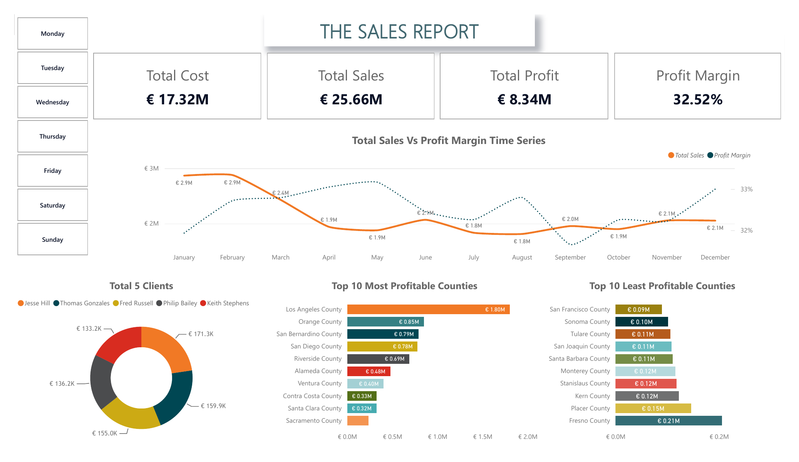
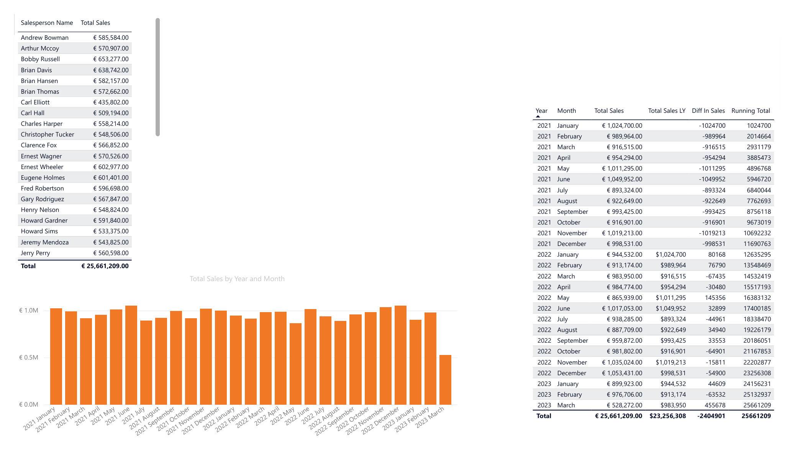

# Retail Sales Performance Dashboard — Power BI

## Overview
An end-to-end Power BI project analyzing three years (2021–2023) of multi-location retail sales data. The report tracks revenue, cost, and profitability trends over time, and identifies top- and bottom-performing regions to support data-driven decisions on inventory, staffing, and budget allocation.

## Dashboard





## Business Questions Addressed
- How has total revenue, cost, and profit margin trended year-over-year?
- Which counties/regions are the most and least profitable?
- Who are the top clients by revenue contribution, and how concentrated is that revenue?
- How does current performance compare to the same period last year (YoY)?

## Data Model
Built as a star schema in Power BI, connecting one central fact table to five supporting dimension tables:

**Fact table**
- `Sales` — Order ID, Product ID, Location ID, Salesperson ID, Customer ID, Order Date, Quantity, Price (2021–2023, ~10,000+ rows combined)

**Dimension tables**
- `Products` — cost, list price, discount, current price, taxes
- `Locations` — county, state, coordinates, population, median household income
- `Customers` — customer names, IDs
- `Sales People` — salesperson names, IDs
- `Dates` (custom-built) — supports time intelligence functions not natively available in Power BI without an explicit calendar table

## Process
1. **Ingestion & cleaning (Power Query):** Connected all source tables, standardized data types, and resolved relationships between fact and dimension tables.
2. **Data modeling:** Built a custom Dates table and established relationships to enable time-based analysis (YoY comparisons, running totals, monthly trends).
3. **DAX measures:** Created calculated measures for revenue, cost, profitability, and time-based comparisons (full list below).
4. **Visualization:** Built KPI cards, a YoY sales trend chart, top/bottom 10 county profitability rankings, and top-client and top-salesperson breakdowns.

## DAX Measures

```dax
Total Sales = SUMX(Sales, Sales[Quantity] * Sales[Price])

Total Profit = [Total Sales] - [Total Cost]

Profit Margin = DIVIDE([Total Profit], [Total Sales])

Total Sales LY = 
IF ([Total Sales] = BLANK(), BLANK(),
CALCULATE([Total Sales], DATEADD(Dates[Date], -1, YEAR)))

Diff In Sales = [Total Sales LY] - [Total Sales]

Running Total = 
CALCULATE(
    [Total Sales],
    FILTER(ALLSELECTED(Dates[Date]), Dates[Date] <= MAX(Dates[Date])),
    Dates[Date] <= MAX(Sales[Order Date])
)
```

**What each measure demonstrates:**
- `Total Sales` — iterative row-by-row calculation with SUMX, since revenue is derived (quantity × price)
- `Total Sales LY` — time intelligence using DATEADD against a proper date dimension
- `Running Total` — cumulative calculation using ALLSELECTED to respect report-level filters while accumulating across the visible date range
- `Diff In Sales` / `Profit Margin` — derived KPIs layered on top of base measures

## Key Insights
- Total sales reached **€25.66M** against **€17.32M** in cost, yielding a **32.52% profit margin**.
- **Los Angeles County** is the top-performing region at **€1.80M** in sales — more than double the next closest county (Orange County, €0.85M).
- The bottom 10 counties (led by Fresno and Placer County) each generate under €0.21M, highlighting a steep long tail in geographic performance — a clear candidate for targeted investment or review.
- The top 5 clients each contribute between €133K–€171K, a fairly even spread rather than heavy dependence on a single account.
- Monthly sales ranged from €1.8M to €2.9M, with profit margin holding steady around 32–33% year-round, indicating consistent cost control despite revenue fluctuation.

## Tools Used
Power BI Desktop (Power Query, Data Modeling, DAX), Excel (source data)

## Notes on Data
This project uses a structured practice dataset designed for Power BI skill-building (star schema design, time intelligence, DAX). It served as the foundation for developing data modeling and dashboarding proficiency. A second, independently-sourced project using real-world ESG/sustainability data is in progress to demonstrate raw data cleaning and judgment-based analysis.
